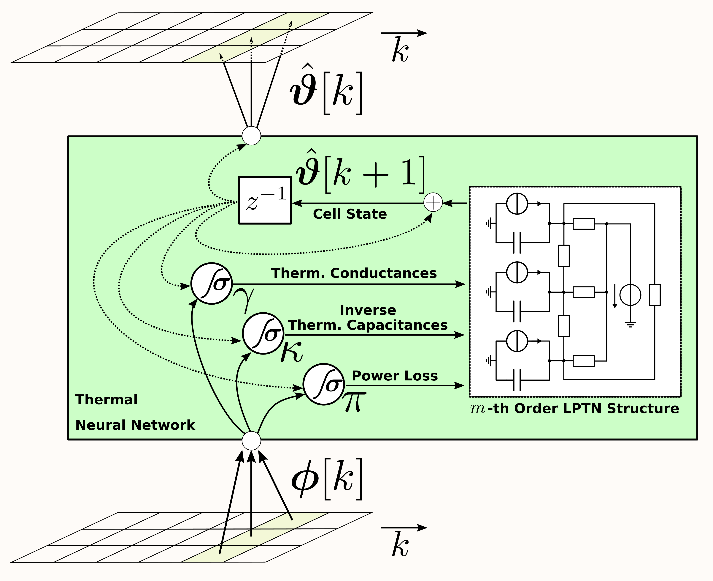

# Thermal Neural Networks
This repository demonstrates the usage of [thermal neural networks (TNNs)](https://doi.org/10.1016/j.engappai.2022.105537) on an electric motor data set.

## Topology



Three function approximators (e.g., multi-layer perceptrons (MLPs)) model the thermal parameters of an arbitrarily complex component arrangement forming a system of interest.
Such a system is assumed to be sufficiently representable by a system of ordinary differential equations (not partial differential equations!).
One function approximator outputs thermal conductances, another the inverse thermal capacitances, and the last one the power losses generated within the components.
The TNN's inner cell working is that of [lumped-parameter thermal networks](https://en.wikipedia.org/wiki/Lumped-element_model#Thermal_systems) (LPTNs).
A LPTN is an electrically equivalent circuit whose parameters can be interpreted to be thermal parameters of a system.
A TNN can be interpreted as a hyper network that is parameterizing a LPTN, which in turn is iteratively solved for the current temperature prediction.

In contrast to other neural network architectures, a TNN needs at least to know which input features are temperatures and which are not.
Target features are always temperatures.
In a nutshell, a TNN solves the difficult-to-grasp nonlinearity and scheduling-vector-dependency in [quasi-LPV](https://en.wikipedia.org/wiki/Linear_parameter-varying_control) systems, which a LPTN represents.

## Code Structure

The streamlined usage can be seen in the jupyter notebooks, one with tensorflow2 (TNN) and two with PyTorch (TNN and NODE).
The tf2-version makes heavy use of auxiliary functions and classes declared in `tf2utils`, whereas the PyTorch notebooks are self-contained and do not import from `tf2utils`. 
Note that the PyTorch examples are substantially simpler and should be preferred for getting started.

## Citing

The TNN is introduced in:
```
@article{kirchgaessner_tnn_2023,
title = {Thermal neural networks: Lumped-parameter thermal modeling with state-space machine learning},
journal = {Engineering Applications of Artificial Intelligence},
volume = {117},
pages = {105537},
year = {2023},
issn = {0952-1976},
doi = {https://doi.org/10.1016/j.engappai.2022.105537},
url = {https://www.sciencedirect.com/science/article/pii/S0952197622005279},
author = {Wilhelm Kirchgässner and Oliver Wallscheid and Joachim Böcker}
}
```

Further, this repository supports and demonstrates the findings around a TNN's generalization to [Neural Ordinary DIfferential Equations](https://arxiv.org/abs/1806.07366) as presented on [IPEC2022](https://www.ipec2022.org/index.html). 
If you want to cite that work, please use
```
@INPROCEEDINGS{kirchgässner_node_ipec2022,
  author={Kirchgässner, Wilhelm and Wallscheid, Oliver and Böcker, Joachim},
  booktitle={2022 International Power Electronics Conference (IPEC-Himeji 2022- ECCE Asia)}, 
  title={Learning Thermal Properties and Temperature Models of Electric Motors with Neural Ordinary Differential Equations}, 
  year={2022},
  volume={},
  number={},
  pages={2746-2753},
  doi={10.23919/IPEC-Himeji2022-ECCE53331.2022.9807209}}
```

The data set is freely available at [Kaggle](https://www.kaggle.com/wkirgsn/electric-motor-temperature) and can be cited as
```
@misc{electric_motor_temp_kaggle,
  title={Electric Motor Temperature},
  url={https://www.kaggle.com/dsv/2161054},
  DOI={10.34740/KAGGLE/DSV/2161054},
  publisher={Kaggle}, 
  author={Wilhelm Kirchgässner and Oliver Wallscheid and Joachim Böcker}, 
  year={2021}}
```
